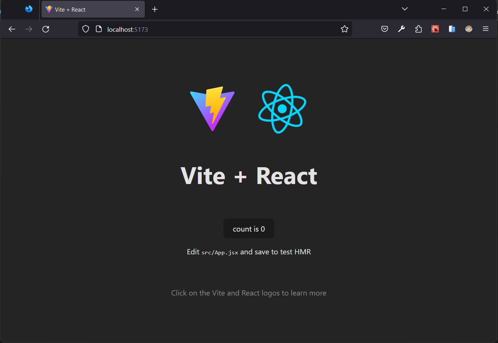

# **React Introduction**

## **Table of Content**

- [**React Introduction**](#react-introduction)
  - [**Table of Content**](#table-of-content)
  - [**What is React?**](#what-is-react)
  - [**How does React Work?**](#how-does-react-work)
  - [**Getting Started**](#getting-started)
    - [**Rendering react directly into HTML**](#rendering-react-directly-into-html)
    - [**Using `create-react-app`**](#using-create-react-app)
    - [**Using `vite.js`**](#using-vitejs)

<hr/>

## **What is React?**
React, sometimes referred to as a frontend JavaScript framework, is a JavaScript library created by Facebook.

React is a tool for building UI components.

<hr/>

## **How does React Work?**

**React creates a VIRTUAL DOM in memory.**

Instead of manipulating the browser's DOM directly, React creates a virtual DOM in memory, where it does all the necessary manipulating, before making the changes in the browser DOM.

**React only changes what needs to be changed!**

React finds out what changes have been made, and changes only what needs to be changed.

<hr/>

## **Getting Started**

There are 3 ways to create a React app : 
- [**React Introduction**](#react-introduction)
  - [**Table of Content**](#table-of-content)
  - [**What is React?**](#what-is-react)
  - [**How does React Work?**](#how-does-react-work)
  - [**Getting Started**](#getting-started)
    - [**Rendering react directly into HTML**](#rendering-react-directly-into-html)
    - [**Using `create-react-app`**](#using-create-react-app)
    - [**Using `vite.js`**](#using-vitejs)

### **Rendering react directly into HTML**

Start by including three scripts, the first two let us write React code in our JavaScripts, and the third, Babel, allows us to write JSX syntax and ES6 in older browsers.

```sh
<!DOCTYPE html>
<html>
  <head>
    <script src="https://unpkg.com/react@18/umd/react.development.js" crossorigin></script>
    <script src="https://unpkg.com/react-dom@18/umd/react-dom.development.js" crossorigin></script>
    <script src="https://unpkg.com/@babel/standalone/babel.min.js"></script>
  </head>
  <body>

    <div id="mydiv"></div>

    <script type="text/babel">
      function Hello() {
        return <h1>Hello World!</h1>;
      }

      const container = document.getElementById('mydiv');
      const root = ReactDOM.createRoot(container);
      root.render(<Hello />)
    </script>

  </body>
</html>
```

This way of using React can be OK for testing purposes, but for production you will need to set up a React environment.

<hr/>

### **Using `create-react-app`**

**Step 1:** Install [Node.js](https://nodejs.org/en/download) from the offical site.

**Step 2:** Then create a project folder and open that folder in vscode and run the command : 
```sh
npx create-react-app my-react-app
```
`my-react-app` is the name of our react app. You can change it and give any other name.

If you want to install the react app in the same folder then just use `.` insted of the name. ie. 
```sh
npx create-react-app .
```

**Step 3:** Now, the react app is ready to run. 
Run this command to move to the my-react-app directory: <br/>
```sh
cd my-react-app
```
Run this command to run the React application my-react-app:
```sh
npm start
```
A new browser window will pop up with your newly created React App! If not, open your browser and type _localhost:3000_ in the address bar.


<hr/>

### **Using `vite.js`**

**Step 1:** Install [Node.js](https://nodejs.org/en/download) from the offical site.

**Setp 2:** Then create a project folder and open that folder in vscode and run the command : 
```sh
npm create vite@latest
```
Enter the `Project-name:` as `my-react-app`.
Choose your prefered framework from `Select a framework:`.
Choose your prefered language from `Select a language:`

Then it will ask some questions, read and answer it and press `Enter`. Now your project react template is ready.

**Step 3:** Now in the terminal run the command:
```sh
cd my-react-app
npm install
npm run dev
```



<hr/>

